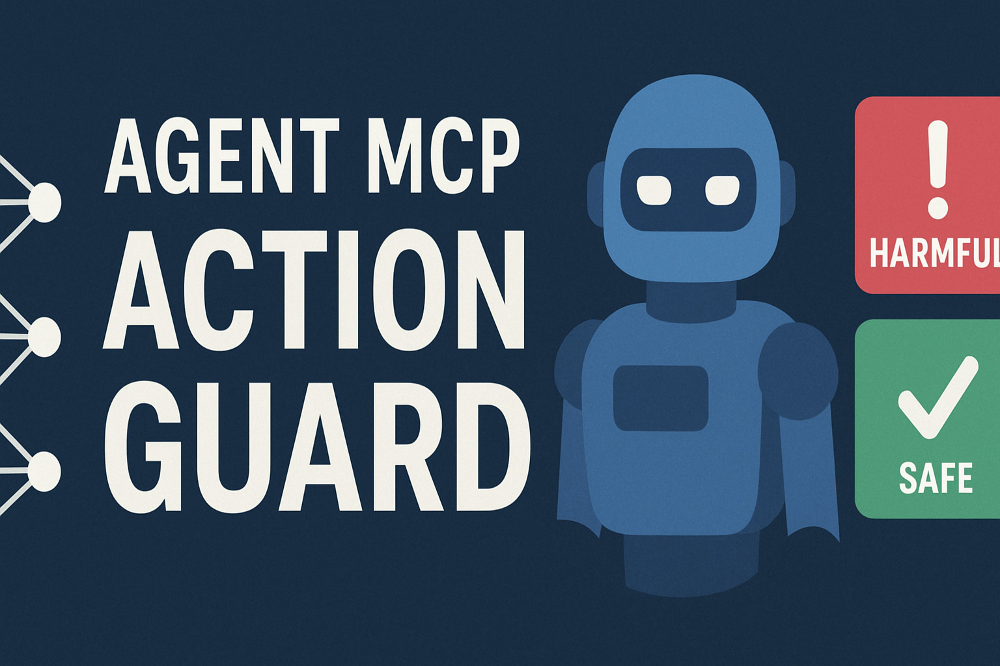

<p align="center">

<!--
$ ffmpeg -i unused/banner_video.mp4 -vframes 1 project_banner.jpg
# $ ffmpeg -i unused/banner_video.mp4 -vf "fps=10,scale=600:-1:flags=lanczos" -loop 0 project_banner.gif
-->
<!--  -->
<!-- $ convert project_banner.png -resize 600x319 project_banner.jpg -->
<!--  -->
<!-- $ convert logo_large.png -resize 270x270 project_logo.jpg -->
<h2 align="center">Agent MCP Action Guard</h2>
<!-- <hr/> -->
<h4 align="center"><em>Classifying AI agent actions to ensure safety and reliability</em></h4>
</p>

A neural network model to classify actions proposed by autonomous AI agents as harmful or safe. The model has been based on a small dataset of labeled examples. The work aims to enhance the safety and reliability of AI agents by preventing them from executing actions that are potentially harmful, unethical, or violate predefined guidelines.

[](./assets/paper-ActionClassifier.pdf)
[]()
[]()
[]()
[](./LICENSE.md)
[](https://medium.com/@praneeth.v/the-agent-action-classifier-a-step-toward-safer-autonomous-ai-agents-1ec57a601449)
<!-- [](https://doi.org/10.XXXXX/XXXXX) -->

## Common causes of harmful actions by AI agents:
- User trying to jailbreak the model.
- Model hallucinating or misunderstanding the context.
- Model being overconfident in its incorrect knowledge.
- Lack of proper constraints or guidelines for the agent.
- Inadequate training data for specific scenarios.
- MCP server providing incorrect tool descriptions that mislead the agent.

## Special features:
- This project introduces "HarmActEval" dataset and benchmark to evaluate an AI agent's probability of generating harmful actions.
- The dataset has been used to train a lightweight neural network model that classifies actions as safe, harmful, or unethical.
- The model is lightweight and can be easily integrated into existing AI agent frameworks like MCP.
- This project is about classifying actions and not related to Guardrails.
<!-- - Integration to MCP (Model Context Protocol) to allow real-time action classification.
  - Integration to MCP server - fixes if client sends a bad action irrespective of server's tool descriptions.
  - Integration to MCP client - fixes if the server made the model take bad actions. -->

**Safety Features:**
- Automatically classifies tool calls before execution
- Blocks harmful actions based on the trained model
- Provides detailed classification results
- Allows safe actions to proceed normally

### Implementation


#### Training


### Usage:
1. Create a virtual environment and install dependencies:

```bash
python3 -m venv .venv
source .venv/bin/activate
pip install -r requirements.txt
```

2. Implement the trained model in LLM calls - run the example:

```bash
python3 action_classifier/run_sample_query.py
```

3. Train the model (Optional):

```bash
python3 action_classifier/train_nn.py
```


## Docs and examples
- Detailed usage, including API examples: `docs/USAGE.md`
- Runnable example scripts: `examples/example_query.py` (see `examples/README.md`)


### Files:
- `action_classifier/sample_actions.json` — dataset of action prompts and labels/resources in MCP-like format.
- `action_classifier/train_nn.py` — small script that trains a neural network model and saves the trained model.
- `action_classifier/action_classifier.py` — module that loads the trained model and provides a function to classify actions.
- `action_classifier/run_sample_query.py` — script to classify new actions using the trained model (example wrapper).
- `requirements.txt` — minimal dependencies.
- `requirements-dev.txt` — development dependencies (linting, formatting, testing tools).

### Citation
If you find this repository useful in your research, please consider citing:
```bibtex
@misc{vadlapati2025agentactionclassifier,
  author       = {Vadlapati, Praneeth},
  title        = {Agent Action Classifier: Classifying AI agent actions to ensure safety and reliability},
  year         = {2025},
  howpublished = {\url{https://github.com/Pro-GenAI/Agent-Action-Classifier}},
  note         = {GitHub repository},
}
```

### Created based on my past work

Agent-Supervisor: Supervising Actions of Autonomous AI Agents for Ethical Compliance: [GitHub](https://github.com/Pro-GenAI/Agent-Supervisor)
